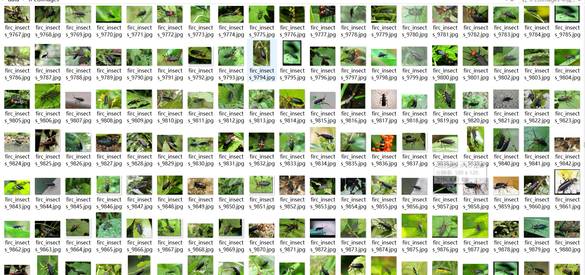
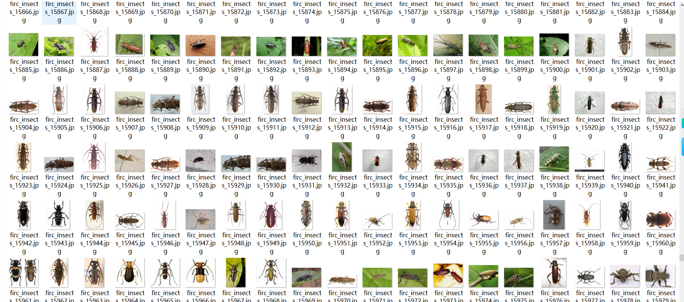
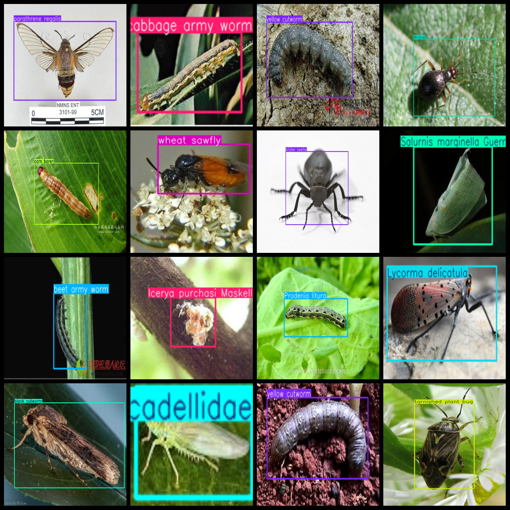
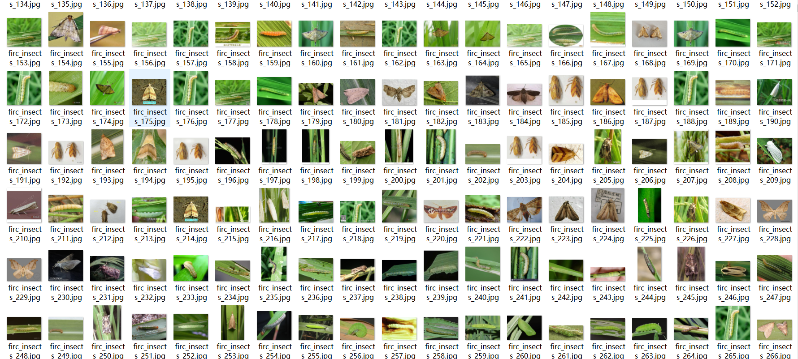

# [Object Detection] Crops Pest Detection Dataset VOC+YOLO format18975 images97-class

Dataset Description: ~~~~~

Dataset format: Pascal VOC format + YOLO format (the txt file does not contain the split path, it only contains jpg images and corresponding VOC format xml files and yolo format txt files)

Number of images (number of jpg files): 18975

Number of annotations (number of xml files): 18975

Number of annotations (number of txt files): 18975

Number of annotation classes: 97

The Github repository is: datasets_sl

Annotation class names: ["Adristyrannus","Aleurocanthus spiniferus","Ampelophaga","Aphis citricola Vander Goot","Apolygus lucorum","Bactrocera tsuneonis","Beet spot flies","Brevipoalpus lewisi McGregor","Ceroplastes rubens","Chlumetia transversa","Chrysomphalus aonidum","Cicadella viridis","Cicadellidae","Dacus dorsalis","Dasineura sp","Deporaus marginatus Pascoe","Erythroneura apicalis","Icerya purchasi Maskell","Lawana imitata Melichar","Limacodidae","Locustoidea","Lycorma delicatula","Mango flat beak leafhopper","Miridae","Nipaecoccus vastalor","Panonchus citri McGregor","Papilio xuthus","Phyllocnistis citrella Stainton","Pieris canidia","Potosiabre vitarsis","Prodenia litura","Pseudococcus comstocki Kuwana","Rhytidodera bowrinii white","Rice Stemfly","Salurnis marginella Guerr","Scirtothrips dorsalis Hood","Sternochetus frigidus","Tetradacus c Bactrocera minax ","Thrips","Toxoptera aurantii","Toxoptera citricidus","Trialeurodes vaporariorum","Unaspis yanonensis","Xylotrechus","alfalfa plant bug","alfalfa seed chalcid","alfalfa weevil","aphids","army worm","asiatic rice borer","beet army worm","beet fly","beet weevil","bird cherry-oataphid","black cutworm","blister beetle","brown plant hopper","cabbage army worm","cerodonta denticornis","corn borer","english grain aphid","flax budworm","flea beetle","grain spreader thrips","green bug","grub","large cutworm","legume blister beetle","longlegged spider mite","lytta polita","meadow moth","mole cricket","odontothrips loti","oides decempunctata","paddy stem maggot","parathrene regalis","peach borer","penthaleus major","red spider","rice gall midge","rice leaf caterpillar","rice leaf roller","rice leafhopper","rice shell pest","rice water weevil","sericaorient alismots chulsky","small brown plant hopper","tarnished plant bug","therioaphis maculata Buckton","wheat blossom midge","wheat phloeothrips","wheat sawfly","white backed plant hopper","white margined moth","wireworm","yellow cutworm","yellow rice borer"]

Number of boxes labeled in each category:

Adristyrannus frame count = 133

Aleurocanthus spiniferus frame count = 148

Ampelophaga frame count = 279

Aphis citricola Vander Goot frame count = 8

Apolygus lucorum frame count = 35

Bactrocera tsuneonis frame count = 27

Beet spot flies frame count = 71

Brevipoalpus lewisi McGregor frame count = 2

Ceroplastes rubens frame count = 370

Chlumetia transversa frame count = 60

Chrysomphalus aonidum frame count = 183

Cicadella viridis frame count = 206

Cicadellidae frame count = 2975

Dacus dorsalis frame count = 131

Dasineura sp frame count = 22

Deporaus marginatus Pascoe frame count = 66

Erythroneura apicalis frame count = 13

Icerya purchasi Maskell frame count = 290

Lawana imitata Melichar frame count = 150

Limacodidae frame count = 224

Locustoidea frame count = 552

Lycorma delicatula frame count = 338

Mango flat beak leafhopper frame count = 13

Miridae frame count = 1268

Nipaecoccus vastalor frame count = 46

Panonchus citri McGregor frame count = 82

Papilio xuthus frame count = 108

Phyllocnistis citrella Stainton frame count = 23

Pieris canidia frame count = 57

Potosiabre vitarsis frame count = 238

Prodenia litura frame count = 436

Pseudococcus comstocki Kuwana frame count = 73

Rhytidodera bowrinii white frame count = 140

Rice Stemfly frame count = 28

Salurnis marginella Guerr frame count = 183

Scirtothrips dorsalis Hood frame count = 77

Sternochetus frigidus frame count = 65

Tetradacus c Bactrocera minax frame count = 58

Thrips frame count = 48

Toxoptera aurantii frame count = 28

Toxoptera citricidus frame count = 22

Trialeurodes vaporariorum frame count = 112

Unaspis yanonensis frame count = 546

Xylotrechus frame count = 157

alfalfa plant bug frame count = 237

alfalfa seed chalcid frame count = 20

alfalfa weevil frame count = 91

aphids frame count = 1395

army worm frame count = 216

asiatic rice borer frame count = 179

beet army worm frame count = 420

beet fly frame count = 34

beet weevil frame count = 157

bird cherry-oataphid frame count = 125

black cutworm frame count = 317

blister beetle frame count = 1013

brown plant hopper frame count = 117

cabbage army worm frame count = 266

cerodonta denticornis frame count = 27

corn borer frame count = 440

english grain aphid frame count = 310

flax budworm frame count = 434

flea beetle frame count = 384

grain spreader thrips frame count = 20

green bug frame count = 72

grub frame count = 676

large cutworm frame count = 176

legume blister beetle frame count = 476

longlegged spider mite frame count = 64

lytta polita frame count = 270

meadow moth frame count = 100

mole cricket frame count = 877

odontothrips loti frame count = 65

oides decempunctata frame count = 176

paddy stem maggot frame count = 25

parathrene regalis frame count = 31

peach borer frame count = 254

penthaleus major frame count = 72

red spider frame count = 168

rice gall midge frame count = 95

rice leaf caterpillar frame count = 130

rice leaf roller frame count = 190

rice leafhopper frame count = 119

rice shell pest frame count = 36

rice water weevil frame count = 153

sericaorient alismots chulsky frame count = 100

small brown plant hopper frame count = 54

tarnished plant bug frame count = 365

therioaphis maculata Buckton frame count = 5

wheat blossom midge frame count = 25

wheat phloeothrips frame count = 108

wheat sawfly frame count = 146

white backed plant hopper frame count = 78

white margined moth frame count = 60

wireworm frame count = 532

yellow cutworm frame count = 209

yellow rice borer frame count = 82

Total boxes: 22282

Number of images per category:

Adristyrannus annotated images = 133

Aleurocanthus spiniferus annotated images = 60

Ampelophaga annotated images = 279

Aphis citricola Vander Goot annotated images = 6

Apolygus lucorum annotated images = 35

Bactrocera tsuneonis annotated images = 25

Beet spot flies annotated images = 69

Brevipoalpus lewisi McGregor annotated images = 2

Ceroplastes rubens annotated images = 65

Chlumetia transversa annotated images = 60

Chrysomphalus aonidum annotated images = 50

Cicadella viridis annotated images = 206

Cicadellidae annotated images = 2936

Dacus dorsalis annotated images = 115

Dasineura sp annotated images = 22

Deporaus marginatus Pascoe annotated images = 64

Erythroneura apicalis annotated images = 12

Icerya purchasi Maskell annotated images = 158

Lawana imitata Melichar annotated images = 128

Limacodidae annotated images = 105

Locustoidea annotated images = 533

Lycorma delicatula annotated images = 338

Mango flat beak leafhopper annotated images = 13

Miridae annotated images = 1265

Nipaecoccus vastalor annotated images = 28

Panonchus citri McGregor annotated images = 43

Papilio xuthus annotated images = 99

Phyllocnistis citrella Stainton annotated images = 23

Pieris canidia annotated images = 56

Potosiabre vitarsis annotated images = 203

Prodenia litura annotated images = 413

Pseudococcus comstocki Kuwana annotated images = 51

Rhytidodera bowrinii white annotated images = 138

Rice Stemfly annotated images = 28

Salurnis marginella Guerr annotated images = 172

Scirtothrips dorsalis Hood annotated images = 75

Sternochetus frigidus annotated images = 64

Tetradacus c Bactrocera minax annotated images = 46

Thrips annotated images = 47

Toxoptera aurantii annotated images = 22

Toxoptera citricidus annotated images = 17

Trialeurodes vaporariorum annotated images = 105

Unaspis yanonensis annotated images = 31

Xylotrechus annotated images = 157

alfalfa plant bug annotated images = 227

alfalfa seed chalcid annotated images = 20

alfalfa weevil annotated images = 82

aphids annotated images = 879

army worm annotated images = 206

asiatic rice borer annotated images = 166

beet army worm annotated images = 413

beet fly annotated images = 34

beet weevil annotated images = 146

bird cherry-oataphid annotated images = 67

black cutworm annotated images = 300

blister beetle annotated images = 935

brown plant hopper annotated images = 111

cabbage army worm annotated images = 246

cerodonta denticornis annotated images = 26

corn borer annotated images = 424

english grain aphid annotated images = 130

flax budworm annotated images = 410

flea beetle annotated images = 345

grain spreader thrips annotated images = 20

green bug annotated images = 27

grub annotated images = 436

large cutworm annotated images = 153

legume blister beetle annotated images = 435

longlegged spider mite annotated images = 59

lytta polita annotated images = 244

meadow moth annotated images = 98

mole cricket annotated images = 869

odontothrips loti annotated images = 65

oides decempunctata annotated images = 134

paddy stem maggot annotated images = 25

parathrene regalis annotated images = 31

peach borer annotated images = 241

penthaleus major annotated images = 71

red spider annotated images = 160

rice gall midge annotated images = 93

rice leaf caterpillar annotated images = 114

rice leaf roller annotated images = 174

rice leafhopper annotated images = 117

rice shell pest annotated images = 36

rice water weevil annotated images = 153

sericaorient alismots chulsky annotated images = 81

small brown plant hopper annotated images = 52

tarnished plant bug annotated images = 348

therioaphis maculata Buckton annotated images = 3

wheat blossom midge annotated images = 24

wheat phloeothrips annotated images = 91

wheat sawfly annotated images = 138

white backed plant hopper annotated images = 78

white margined moth annotated images = 49

wireworm annotated images = 424

yellow cutworm annotated images = 194

yellow rice borer annotated images = 81

Image resolution: multi-resolution images,e.g. 448x248,296x221etc.

Use the labeling tool: labelImg

Dataset Augmentation: No

Rules for annotation: Draw a rectangle around the category.

Important note: The dataset does not have been divided into training, validation, and testing sets.

Special Disclaimer: This dataset does not guarantee the accuracy of the trained models or weight files.

## Images

---

Here is a pay link on Stripe (https://buy.stripe.com/3cs8yP7sY87d0vu9AB). Please contact me lonlonago@foxmail.com after funding $89, and I will send you a complete data files, thank you!

